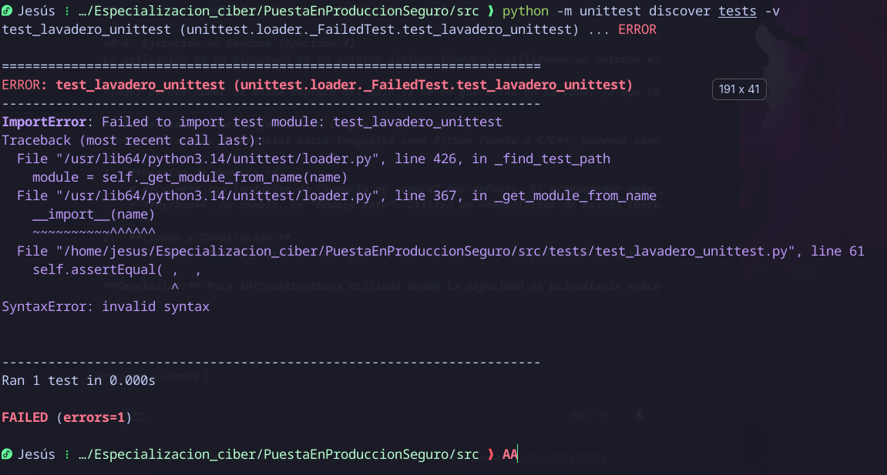
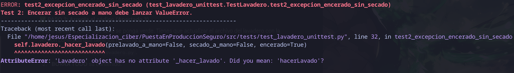
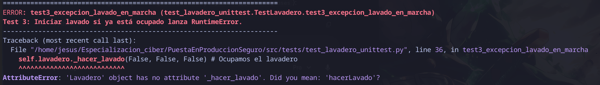

# Apartado 2: Ejecución y Depuración
Lo primero que hice fue intentar ejecutar el archivo `main_app.py`. El programa no arrancaba. Tuve que usar el depurador de VS Code y la terminal para encontrar los siguientes errores de sintaxis y estructura.

## 1. Errores de Estado y Validaciones (Tests 1–3)

### Error 1: Inicialización Incorrecta (Test 1)

* **El Problema**
  El test fallaba al verificar que un lavadero nuevo tuviera los ingresos a `0.0` y las opciones desactivadas.
  

* **La Causa**
  El constructor `__init__` original no garantizaba un *estado limpio* ni reseteaba las banderas a `False` al crearse el objeto.

* **Solución**
  Se modificó el constructor para inicializar explícitamente todas las variables a `False` y `0.0` (o llamar internamente al método `terminar()`).

---

### Error 2: Validación de Encerado (Test 2)

* **El Problema**
  El sistema permitía contratar **encerado** sin haber pedido **secado a mano**, violando las reglas de negocio y sin lanzar la excepción esperada.
  

* **La Causa**
  Faltaba una cláusula de guarda al inicio del método `_hacer_lavado`.

* **Solución**
  Se añadió la validación:

  ```python
  if encerado and not secado_a_mano:
      raise ValueError(...)
  ```

---

### Error 3: Lavadero Ocupado (Test 3)

* **El Problema**
  Se podía iniciar un nuevo lavado mientras otro ya estaba en curso.
  
  

* **La Causa**
  No se verificaba el flag `self.ocupado` antes de aceptar un coche nuevo.

* **Solución**
  Se añadió el control:

  ```python
  if self.ocupado:
      raise RuntimeError(...)
  ```
